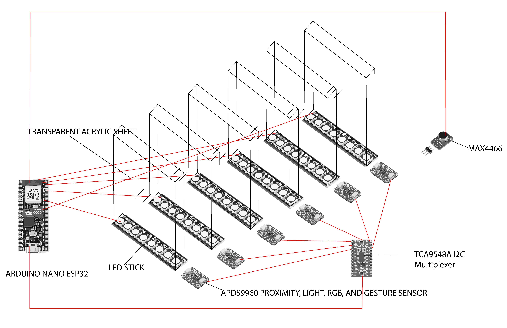

# Interactive Acrylic Pillars (Kinetic Strip Redesign)

## 1. Overview
A distributed interactive array of 6 lighting modules. Each module integrates an LED stick, a transparent acrylic diffuser, and a gesture/proximity sensor. The system balances collective audio-reactive behavior with localized user interaction.

## 2. Technical Architecture & Wiring
The following diagram illustrates the connectivity between the Arduino Nano ESP32, the sensors, and the LED sticks.

### Core Components
- **Controller:** Arduino Nano ESP32.
- **Audio Input:** MAX4466 Electret Microphone (Connected to **A0**).
- **Sensors:** 6x APDS9960 (Proximity, Light, RGB, Gesture).
- **I2C Multiplexer:** TCA9548A (To address 6 identical sensors on the same I2C bus).
- **Lighting:** 6x WS2812B LED Sticks (Each on a dedicated GPIO).
- **Structure:** 6x Transparent Acrylic Sheets mounted above each LED stick.

### Connectivity Map
- **I2C Bus:** ESP32 (SDA/SCL) $\rightarrow$ TCA9548A $\rightarrow$ 6x APDS9960 (Channels 0-5).
- **LED Sticks (Independent GPIOs):**
    - LED 1: GPIO 13
    - LED 2: GPIO 14
    - LED 3: GPIO 27
    - LED 4: GPIO 26
    - LED 5: GPIO 25
    - LED 6: GPIO 33

## 3. Interaction Logic
- **Ambient Mode (Music Reaction):** In the absence of proximity, all 6 pillars pulse and change colors in synchronization with the music captured by the MAX4466.
- **Interactive Mode (Local Trigger):** When a hand approaches a specific APDS9960 sensor, the corresponding LED stick switches to a unique "intervention" pattern (e.g., rapid flashing or a specific color), while the other 5 pillars continue their music-responsive behavior.

## 4. Power Requirements (CRITICAL)
**DO NOT rely on ESP32 USB power for this setup.**
- **Total LEDs:** 48 (6 sticks × 8 LEDs).
- **Peak Current:** ~2.9A (at full white brightness).
- **Recommended Power:** **5V 4A DC External Power Supply**.
- **Wiring Tip:** Ensure a **Common Ground** between the external power supply and the ESP32. Use thick wires (22AWG or better) for the main power rail to avoid voltage drops.

---
*Project documentation for the Kinetic Strip evolution.*
