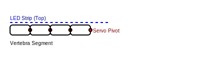

# Kinesthetic Responsive LED Strip - "The Living Ribbon"

## 1. Overview
A shape-shifting, illuminated kinetic sculpture. This project combines a high-density LED strip with a motorized actuation system to create an object that physically moves and changes color in response to sound. It explores the concept of "living light" that reacts kinesthetically to its sonic environment.

## 2. The Core Questions
- **What is it?** An animatronic light strip that behaves like a biological organism, responding to sound with physical motion.
- **Why does it exist?** To bridge the gap between static lighting and physical performance. It treats light not just as photons, but as a physical, moving substance.
- **Where does it live?** It can be a **Desktop Sculpture**, a **Wall-Mounted Installation**, or a **Wearable Spine**.
- **When does it operate?** It is dormant in silence and "wakes up" (uncoils/pulses) when sound is detected.

## 3. Interaction Logic
- **Audio Input:**
    - **Volume (Amplitude):** Controls the **Degree of Uncoiling**. Louder sounds cause the strip to stretch out; silence makes it curl up for "protection."
    - **Rhythm (Beat):** Triggers **Traveling Pulses** of light that move down the strip, synchronized with the physical extension.
    - **Pitch (Frequency):** Could subtly affect the speed of movement or the color palette (e.g., Bass = Slow/Red, Treble = Fast/Blue).

## 4. Technical Implementation & Mechanics

### Skeleton and Structure
A 3D-printed vertebral column inside the silicone holds the servos and allows for controlled bending.

### Physical Joint Mechanics
- **Servo Placement:** Micro Servos (e.g., SG90) are placed at each pivot point between vertebral segments. The servo body is housed within one segment, with its rotational axis aligned with the pivot point.
- **Pivot Points:** Simple pin joints are located at the junction of each vertebral segment, allowing for a single degree of freedom.
- **Coiling Motion:** The coiling motion is achieved by sequentially actuating the servos in an alternating pattern to create a spiral.

### Hardware & Control
- **Controller:** Arduino or ESP32 to coordinate motor positions and LED patterns.
- **Light:** Addressable LED Strip (e.g., WS2812B/NeoPixel) inside the silicone casing.
- **Sensors:** Microphone Sensor for audio amplitude and frequency.
- **Actuators:** Direct Joint Actuation (Small servos) to drive the coiling motion.
- **Power:** External 5V high-current power supply.
- **Control Logic:** Inverse Kinematics (IK) code on the MCU to calculate servo angles for smooth coiling.
